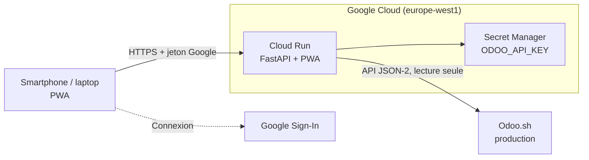

# Architecture

## Principes
- **Odoo reste la source unique.** Aucune donnée comptable n'est stockée côté application : un cache mémoire de 5 min (30 s minimum entre deux « actualiser ») protège Odoo.
- **Temps réel pratique** : l'écran se rafraîchit toutes les 60 s quand il est visible. Les chiffres reflètent l'état d'Odoo au moment du dernier appel.
- **Lecture seule vérifiée** : l'utilisateur technique n'a aucun droit d'écriture (`scripts/odoo_check.py` le contrôle sans rien écrire).
- **Un seul service** (API + PWA) pour limiter coûts et maintenance ; échelle à zéro hors usage.

## Règles de calcul
- BU = 3 derniers chiffres des comptes 602/603/604/700 ; marge brute = CA − (602+603+604) ; personnel et 615 exclus ; comptes « old - » ignorés (`backend/app/bu.py`).
- Rapprochement avec l'analyse de septembre 2026 : CA identique à l'euro quand on ne retient que les écritures créées avant le 04/09 ; le dashboard, lui, intègre les écritures saisies après coup (ex. 39 885 € de frais tardifs).
- Créances et dettes : montant restant dû (`amount_residual_signed`) des factures et avoirs validés (brouillons exclus) non payés ou partiellement payés, dont la date comptable est dans l'année de référence (l'année de la période affichée) — comme les écrans « Factures à payer » d'Odoo. Les accruals (« factures à recevoir ») et les écritures hors factures ne comptent pas. Trésorerie : soldes des comptes bancaires, caisse et cartes.
- Hit-parade : CA des comptes 700 par partenaire (contact tel que saisi sur la pièce).
- Webshops : commandes confirmées (`sale`, `done`) par site web, HT, hors lignes de service (livraison). Correspondance dans `app/settings.py` (`WEBSHOP_LABELS`).

## Coûts et sécurité (ordre de grandeur)
- Cloud Run à l'échelle zéro : quelques euros par mois ou moins pour 2–10 utilisateurs ; Secret Manager < 1 €/mois.
- Accès : jeton Google vérifié côté serveur, domaine Workspace + liste blanche d'emails (`ALLOWED_EMAILS`).
- Aucun secret dans le dépôt ; la clé Odoo n'existe que dans Secret Manager.

## Regroupement de clients (hit-parade)
- Dans Odoo, ajouter au contact (ou à sa société) l'étiquette **`regroup_client=Nom du groupe`** (casse et espaces autour du « = » sans importance).
- Tous les contacts qui portent le même nom de groupe sont additionnés dans le classement.
- Sans étiquette, les contacts d'une même société sont fusionnés automatiquement (société = `commercial_partner_id`).
- Si Odoo refuse la lecture des contacts, le classement revient aux noms tels que saisis et l'écran l'indique.
- Contrôle : `python scripts/odoo_check.py` liste les étiquettes trouvées.

## Noms de clients
L'affichage des noms est uniformisé (`backend/app/names.py`), sans rien modifier dans Odoo : mots tout en majuscules de 4 lettres et plus → majuscule initiale ; sigles de 1 à 3 lettres et formes juridiques (SL, SARL, GmbH, s.r.o.) uniformisés ; texte entre parenthèses et mots en casse mixte inchangés.

## Solde ouvert par client (hit-parade)
- Pour chaque client : reste dû TTC (`amount_residual_signed`) des factures et avoirs clients comptabilisés dans la période, non payés ou partiellement payés.
- Par BU : le reste dû d'une facture est réparti entre les BU au prorata de ses lignes de CA (comptes 700).
- Si Odoo refuse la lecture, le classement s'affiche sans cette colonne et l'écran l'indique.

## Hit-parade fournisseurs
- Source : lignes de factures et avoirs fournisseurs comptabilisés (`display_type = product`, donc hors TVA et hors écriture de tiers), par fournisseur, pour la période.
- Rattachement à une BU d'après le **compte comptable de chaque ligne** : 602 / 603 / 604 + suffixe de BU (voir `bu.py`). Les autres comptes (frais généraux, véhicules, honoraires…) et 604099 vont dans « Hors BU ». L'onglet « Général » reprend toutes les lignes.
- Regroupements : étiquette Odoo **`regroup_fournisseur=Nom`** (distincte de celle des clients) ; les contacts d'une même société sont fusionnés.
- « Reste à payer » : reste dû TTC des factures de la période non soldées, réparti par BU au prorata des lignes de chaque facture.
